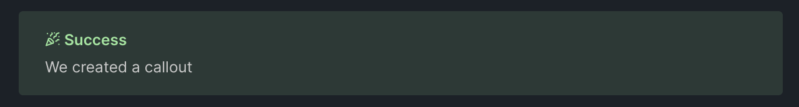

# Converting markdown to HTML

- [[#Introduction|Introduction]]
- [[#Default elements|Default elements]]
	- [[#Default elements#Custom callout|Custom callout]]
	- [[#Default elements#Parsing the custom callout|Parsing the custom callout]]


## Introduction

First, we'll need to define a set of markdown elements, such as headings, links, dividers, and codeblocks.

## Default elements

The standard elements are a must, and should be relatively easy to implement. Here's a broken-down example:

```go
package parser

// # title
type h1 string
...

// ###### heading 6
type h6 string

// paragraph
type p string

// [text](location)
type a string

// 
type img string

// `code`
type code string
```

I'm defining custom types for the markdown elements, which will be used to parse the markdown into HTML. This way, we could build a simple abstract syntax
tree (AST).

### Callout syntax

```md
>[!callout-type] title (optional)
>Contents
```

Examples:

```md
>[!quote]
>Markdown is not only lightweight and simple,
but it gives a great amount of control over the layout and flow
>*\- pynezz*
```

```md
>[!tip]
>Here's a tip callout
```


Some more types:

>[!info]
> info

>[!warning]
>Warning callout

>[!summary]
>Summa summarum


---

### Custom callout

*some styles are applied to override Obsidian styling, such as `border: none`*

```html
<blockquote style="
			background:#a6e3a120;
			width: 100%;
			height: 100%;
			padding: 1rem 1rem 0 1.5rem;
			margin:0px;
			border-radius:0.25rem;
			border:none;
			color:#cacaca;
			font-style:normal;">
  <strong style="
	  margin-bottom:0px;
	  font-weight: 600;
	  color: #a6e3a1;">
	  :LiPartyPopper: Success
  </strong>
  <p style="padding:0px; margin-top:0.25rem; padding-bottom: 1rem">
	  We created a callout
  </p>
</blockquote>
```

<!--
<blockquote style="background:#a6e3a120; width: 100%; height: 100%; padding: 1rem 1rem 0 1.5rem; margin:0px; border-radius:0.25rem; border:none; color:#cacaca; font-style:normal;">
<strong style="margin-bottom:0px; font-weight: 600; color: #a6e3a1;">:LiPartyPopper: Success</strong>
<p style="padding:0px; margin-top:0.25rem; padding-bottom: 1rem">We created a callout</p>
</blockquote>
-->



### Parsing the custom callout

When looking for a custom callout in the markdown, we'll look for the syntax:

```md
>[!callout-type]
>contents
```

We'll define custom types for the different callouts, and parse it into HTML accordingly.

```go
package parser

// CalloutType is a custom type for callouts
// It will be used to parse the markdown into HTML
// and build an abstract syntax tree (AST)

type CalloutType string

const (
	Quote CalloutType = "quote"
	Tip   CalloutType = "tip"
	Info  CalloutType = "info"
	...
)
```
