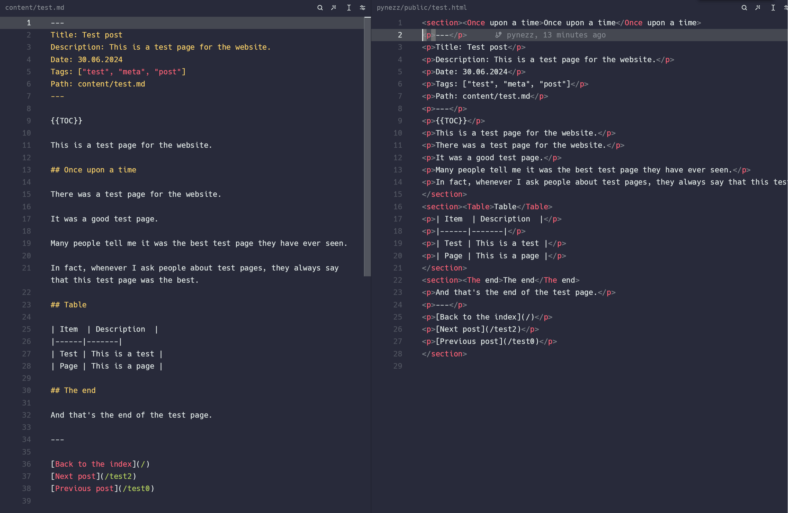

# Converting markdown to HTML

- [Converting markdown to HTML](#converting-markdown-to-html)
  - [Changelog](#changelog)
    - [Latest](#latest)
	- [Introduction](#introduction)
	- [Default elements](#default-elements)
		- [Callout syntax](#callout-syntax)
		- [Custom callout](#custom-callout)
		- [Parsing the custom callout](#parsing-the-custom-callout)

## Changelog

### Latest

**12th of July 2024**


🎉 **Progress!** After running the CMS module with the `--parse` parameter, it indeed did parse the markdown file, although it contains a lot of rough edges in this initial run.

```output
❯ go run . cms --parse
[+] Contents database initialized
[+] Main database initialized
╭────────────────╮
│ pynezz.dev CLI │
╰────────────────╯

Hello from the CMS module!
[0]:--parse
🔌 Checking database connection...
🎉 Database connected!
running command:  parse
[DEBUG] parseall function called!
ParseAll called
[i] Found directory: content
[i] Found file: content/hello-world.md
[i] Found file: content/test.md
Converting hello-world.md to hello-world.md.html
[DEBUG] file not parsed: content/hello-world.md
Parsing markdown file hello-world.md to HTML
parsed data:
 {  0001-01-01 00:00:00 +0000 UTC 0001-01-01 00:00:00 +0000 UTC []}
[+] Metadata parsed successfully
Converting hello-world.md to hello-world.md.html
[i] parsed content written to file: hello-world.html (ਂ bytes)
Converting test.md to test.md.html
[DEBUG] file not parsed: content/test.md
Parsing markdown file test.md to HTML
parsed data:
 {  0001-01-01 00:00:00 +0000 UTC 0001-01-01 00:00:00 +0000 UTC []}
[+] Metadata parsed successfully
Converting test.md to test.md.html
[i] parsed content written to file: test.html (Ϊ bytes)
```


## Introduction

First, we'll need to define a set of markdown elements, such as headings, links, dividers, and codeblocks.

## Default elements

The standard elements are a must, and should be relatively easy to implement. Here's a broken-down example:

```go
package parser

// # title
type h1 string
...

// ###### heading 6
type h6 string

// paragraph
type p string

// [text](location)
type a string

// 
type img string

// `code`
type code string
```

I'm defining custom types for the markdown elements, which will be used to parse the markdown into HTML. This way, we could build a simple abstract syntax
tree (AST).

### Callout syntax

```md
>[!callout-type] title (optional)
>Contents
```

Examples:

```md
>[!quote]
>Markdown is not only lightweight and simple,
but it gives a great amount of control over the layout and flow
>*\- pynezz*
```

```md
>[!tip]
>Here's a tip callout
```


Some more types:

>[!NOTE] Information
> Information callout

>[!WARNING]
>Warning callout

>[!summary]
>Summa summarum


---

### Custom callout

*some styles are applied to override Obsidian styling, such as `border: none`*

```html
<blockquote style="
			background:#a6e3a120;
			width: 100%;
			height: 100%;
			padding: 1rem 1rem 0 1.5rem;
			margin:0px;
			border-radius:0.25rem;
			border:none;
			color:#cacaca;
			font-style:normal;">
  <strong style="
	  margin-bottom:0px;
	  font-weight: 600;
	  color: #a6e3a1;">
	  :LiPartyPopper: Success
  </strong>
  <p style="padding:0px; margin-top:0.25rem; padding-bottom: 1rem">
	  We created a callout
  </p>
</blockquote>
```

<!--
<blockquote style="background:#a6e3a120; width: 100%; height: 100%; padding: 1rem 1rem 0 1.5rem; margin:0px; border-radius:0.25rem; border:none; color:#cacaca; font-style:normal;">
<strong style="margin-bottom:0px; font-weight: 600; color: #a6e3a1;">:LiPartyPopper: Success</strong>
<p style="padding:0px; margin-top:0.25rem; padding-bottom: 1rem">We created a callout</p>
</blockquote>
-->


### Parsing the custom callout

When looking for a custom callout in the markdown, we'll look for the syntax:

```md
>[!callout-type]
>contents
```

We'll define custom types for the different callouts, and parse it into HTML accordingly.

```go
package parser

// CalloutType is a custom type for callouts
// It will be used to parse the markdown into HTML
// and build an abstract syntax tree (AST)

type CalloutType string

const (
	Quote CalloutType = "quote"
	Tip   CalloutType = "tip"
	Info  CalloutType = "info"
	...
)
```

The parser will look for the callout syntax, and parse it into the correct HTML.

Something like this:

```go
package parser

func ParseCallout(calloutType CalloutType, contents string) string {
	if calloutType == nil {
		return fmt.Sprintf("<blockquote><p>%s</p></blockquote>", contents)
	}

	return fmt.Sprintf("<blockquote class='%s'><p>%s</p></blockquote>", calloutType, contents)
}
```
